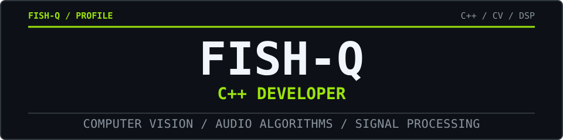

<!-- GitHub Profile README - FISH-Q -->

  

  C++ developer focused on computer vision, audio algorithms, and signal processing.

<h3 align="center">TECH STACK</h3>

  
  
  
  
   
  
  
  

<h3 align="center">ACTIVITY</h3>

  <picture>
    <source media="(prefers-color-scheme: dark)" srcset="https://raw.githubusercontent.com/FISH-Q/FISH-Q/output/github-snake-dark.svg" />
    <source media="(prefers-color-scheme: light)" srcset="https://raw.githubusercontent.com/FISH-Q/FISH-Q/output/github-snake.svg" />
    
  </picture>

