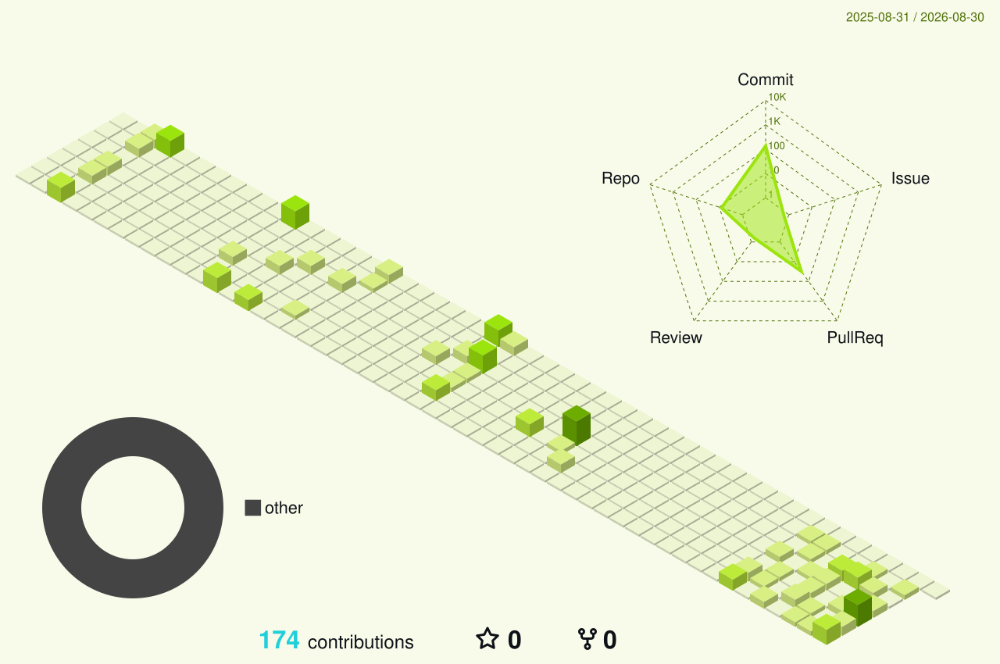

<!--
  GitHub Profile README - FISH-Q
  Palette: #9CE40D main / #21CFDA accent / #F8FBE9 light / #0D1117 dark.
-->

  

  

   
  

    C++ Developer
  

  ABOUT ME

<table align="center" style="border-collapse:separate;">
  <tr>
    <td style="background-color:#F8FBE9;border:1px solid #9CE40D;border-radius:16px;padding:26px 30px;">
      <h3 style="color:#0D1117;font-size:20px;line-height:1.6;font-weight:800;margin:0;">
        Hi, I’m FISHQ. My research interests include computer vision and audio algorithms & signal processing.
        📌 Motto: Courage matters mare than competence.
      </h3>
    </td>
  </tr>
</table>

  TECH STACK

<table align="center" style="border-collapse:separate;border-spacing:16px;">
  <tr>
    <td align="center" style="background-color:#F8FBE9;border:1px solid #9CE40D;border-radius:16px;padding:22px 24px;">
      
CORE DEVELOPMENT

      
      
       
      
      
       
      
    </td>
    <td align="center" style="background-color:#F8FBE9;border:1px solid #9CE40D;border-radius:16px;padding:22px 24px;">
      
COMPUTER VISION

      
      
       
      
    </td>
  </tr>
</table>

  FEATURED WORK

<table align="center" style="border-collapse:separate;border-spacing:16px;">
  <tr>
    <td valign="top" width="50%" style="background-color:#F8FBE9;border:1px solid #9CE40D;border-radius:16px;padding:22px 24px;">
      
AUDIO / VIDEO

      <h3 style="color:#0D1117;margin:0 0 10px 0;">FFmpeg Codec Lab</h3>
      
Codec experiments and media pipeline notes with FFmpeg.

      <a href="https://www.fishq.top/index.php/2025/07/01/ffmpeg/">Read the notes</a>
    </td>
    <td valign="top" width="50%" style="background-color:#F8FBE9;border:1px solid #9CE40D;border-radius:16px;padding:22px 24px;">
      
COMPUTER GRAPHICS

      <h3 style="color:#0D1117;margin:0 0 10px 0;">OpenGL Rendering Pipeline</h3>
      
Rendering pipeline notes covering shaders, VAO, and VBO.

      <a href="https://www.fishq.top/index.php/2025/07/20/openglvao-vbo/">Read the notes</a>
    </td>
  </tr>
</table>

  GITHUB PULSE

  <a href="https://github.com/FISH-Q">
    <picture>
      <source media="(prefers-color-scheme: dark)" srcset="https://github-readme-stats-eight-theta.vercel.app/api?username=FISH-Q&show_icons=true&hide_border=true&border_radius=12&title_color=21CFDA&icon_color=9CE40D&text_color=F8FBE9&bg_color=0D1117&cache_seconds=86400" />
      <source media="(prefers-color-scheme: light)" srcset="https://github-readme-stats-eight-theta.vercel.app/api?username=FISH-Q&show_icons=true&hide_border=true&border_radius=12&title_color=21CFDA&icon_color=9CE40D&text_color=0D1117&bg_color=F8FBE9&cache_seconds=86400" />
      
    </picture>
  </a>

<table align="center" style="border-collapse:separate;border-spacing:16px;">
  <tr>
    <td align="center" style="background-color:#F8FBE9;border:1px solid #9CE40D;border-radius:16px;padding:18px 24px;">
      
LANGUAGE FOCUS

      
      
       
      
      
    </td>
  </tr>
</table>

  MY CONTRIBUTION

  <picture>
    <source media="(prefers-color-scheme: dark)" srcset="https://raw.githubusercontent.com/FISH-Q/FISH-Q/output/github-snake-dark.svg" />
    <source media="(prefers-color-scheme: light)" srcset="https://raw.githubusercontent.com/FISH-Q/FISH-Q/output/github-snake.svg" />
    
  </picture>

  3D CONTRIBUTION

  

